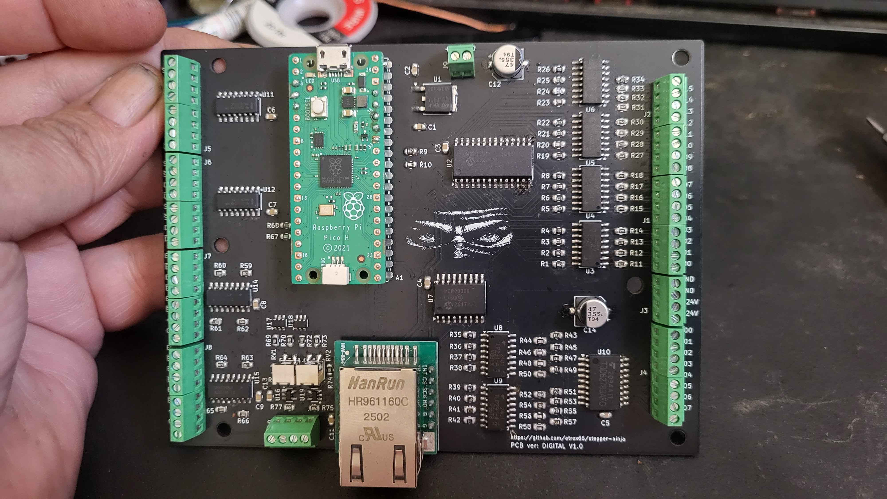

# stepper-ninja

Nyílt forráskódú, ingyenes, nagy teljesítményű step-generátor, kvadratúrás enkóderszámláló, digitális I/O és PWM interfész LinuxCNC-hez.

Az encoder modul lehetővé teszi a főorsó-szinkron mozgások használatát is, például a menetvágást és más főorsóhoz szinkronizált mozgásokat.

A stepper-ninja használatához nincs szükség a hivatalos breakout boardra. Egy olcsó printer-port breakout board is elég lehet, és más konfigurációk is használhatók.

## Dokumentáció

- [Telepítési útmutató](docs/INSTALL.hu.md)
- [Konfigurációs útmutató](docs/CONFIG.hu.md)
- [IP konfiguráció](docs/IPCONFIG.hu.md)
- [Saját breakout board készítése](docs/MAKE-YOUR-OWN-BREAKOUTBOARD.hu.md)

## Nyelvek

- [English](README.md)
- [Deutsch](README.de.md)
- [हिन्दी](README.hi.md)
- [Magyar](README.hu.md)
- [Português (Brasil)](README.pt-BR.md)

## Főbb jellemzők

- **Támogatott konfigurációk**:

  - W5100S-evb-pico UDP Ethernet
  - W5500-evb-pico
  - W5100S-evb-pico2
  - W5500-evb-pico2
  - pico + W5500 modul
  - pico2 + W5500 modul
  - pico + Raspberry Pi4 SPI kapcsolaton
  - pico2 + Raspberry Pi4 SPI kapcsolaton
  - pico + PI ZERO2W SPI kapcsolaton
  - pico2 + PI ZERO2W SPI kapcsolaton
  - hivatalos Stepper-Ninja breakout board

- **Breakout-board v1.0 - digitális verzió**: 16 optocsatolt bemenet, 8 optocsatolt kimenet, 4 step-generátor, 2 nagysebességű enkóderbemenet, 2 unipoláris 12 bites DAC kimenet.

- **step-generator**: maximum 8 Pico 1 esetén, maximum 12 Pico2 esetén. Csatornánként akár 1 MHz. Az impulzusszélesség HAL pinről állítható.

- **quadrature-encoder**: maximum 8 Pico1 esetén, maximum 12 Pico2 esetén. Nagy sebesség, indexkezelés, sebességbecslés és főorsó-szinkron mozgások támogatása.

- **digitális I/O**: a Pico szabad lábai bemenetként és kimenetként konfigurálhatók.

- **PWM**: legfeljebb 16 GPIO használható PWM kimenetként.

- **Szoftver**: LinuxCNC HAL driver több példánnyal és biztonsági funkciókkal.

- **Open source**: a kód és a dokumentáció MIT licenc alatt érhető el.

## Licenc

- A kvadratúrás encoder PIO program a Raspberry Pi (Trading) Ltd. BSD-3 licencét használja.
- Az `ioLibrary_Driver` a Wiznet MIT licencével érhető el.