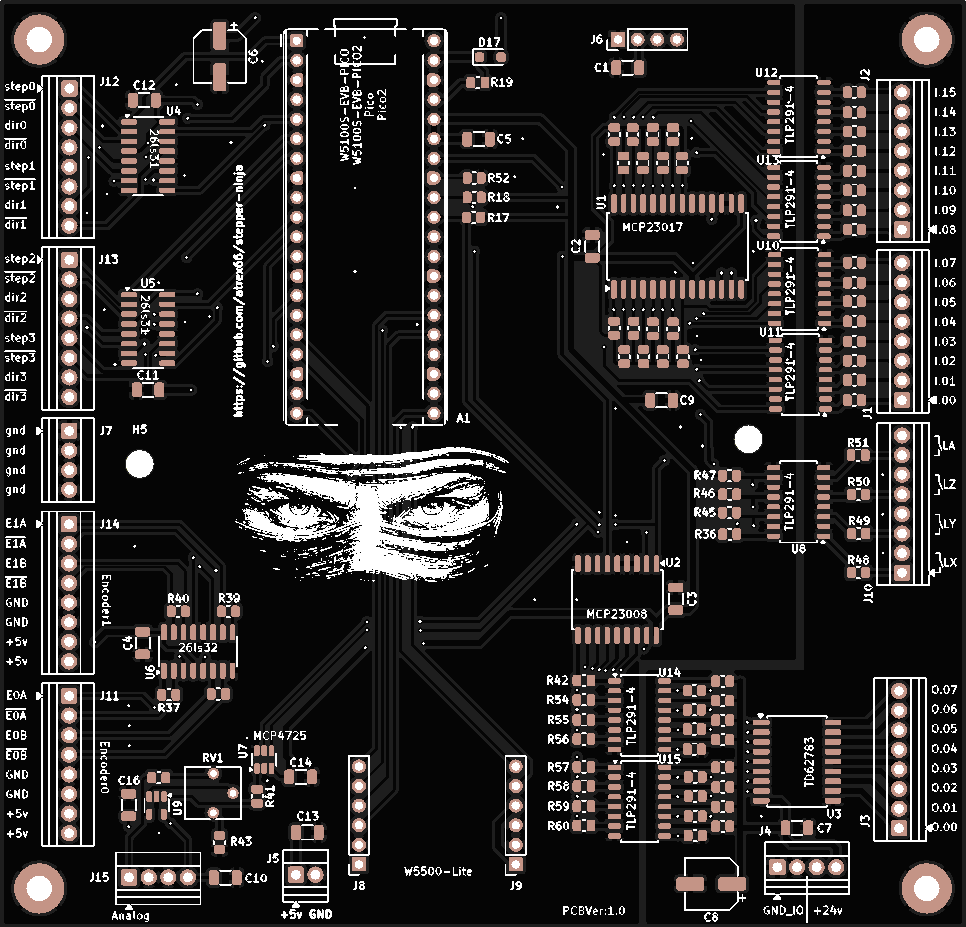

# stepper-ninja

An open-source, free, high performance step/generator, quadrature encoder counter, digital input/output, pwm interface for LinuxCNC using W5100S-evb-pico or pico + W5500 module.

You definietly not need this to work with the ninja, only a W5100S-evb-pico or a normal pico + W5500 module and a cheap printerport breakout board!

## Features

- **communication**:

  - W5100S-evb-pico UDP Ethernet. <https://docs.wiznet.io/Product/iEthernet/W5100S/w5100s-evb-pico>
  - pico + W5500 module (need same wiring as W5100S-evb-pico)
  - planned support communication over spi with raspberry-pi4

- **step-generator**: multiple channels 1Mhz per channel. pulse width set from hal pin (96nS - 6300 nS).

- **quadrature-encoder**: multiple channels 12.5MHz count rate per channel (theoretical).

- **digital IO**: you can configure the free pins of the pico to inputs and outputs

- **Spindle encoder index**: you can configure 1 GPIO to handle Spindle encoder index signal in the config.h (dedicated hal pin, spindle.index-enable)

- **pwm**: you can configure 1 GPIO for the pwm signal (1900Hz(16bit resolution) to 1Mhz(7bit resolution)) and can configure active low or active high

- **Software**:
  - LinuxCNC HAL driver supporting multiple instances (max 4), with safety functions (timeout, data checks). (tested with raspberry-pi4)

- **Open-Source**: code and docs under MIT License.

- **ready-to-ride**: w5100s-evb-pico and w5500 + pico version prebuilt uf2 in the binary directory. To install the hal driver you need to run the install.sh in the hal-driver directory

## Contributors

- **code**: atrex66

- **testing**: Jimfong1

## Contact

- **Discord**:

  - [stepper-ninja Discord](https://discord.gg/4MuegvNU)

## License

- The quadrature encoder PIO program uses BSD-3 license by Raspberry Pi (Trading) Ltd.
- The `ioLibrary_Driver` is licensed under the MIT License by Wiznet.
