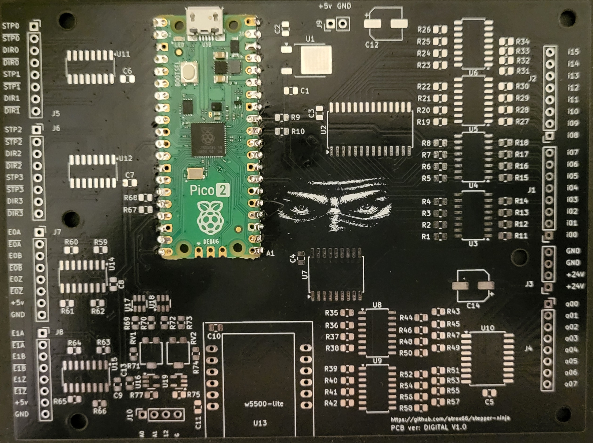

# stepper-ninja

An open-source, free, high performance step/generator, quadrature encoder counter, digital input/output, pwm interface for LinuxCNC.

You definietly not need this to work with the ninja, only a cheap printerport breakout board, other configurations are possible!

## Features

- **Supported configurations**:

  - W5100S-evb-pico UDP Ethernet. <https://docs.wiznet.io/Product/iEthernet/W5100S/w5100s-evb-pico>
  - W5500-evb-pico (same as above)
  - W5100S-evb-pico2 (same as above)
  - W5500-evb-pico2 (same as above)
  - pico + W5500 module (need same wiring as W5100S-evb-pico)
  - pico2 + W5500 module (if you use pico2 board with 48 GPIO you can use the extra GPIO now)
  - pico + Raspberry Pi4 (Uses direct SPI connection, tested with linuxcnc official iso, utilizes the extra GPIO from the PI4)
  - pico2 + Raspberry Pi4 (same as above)
  - pico + PI ZERO2W (Uses SPI connection, linuxcnc runs with linuxcncrsh, tested on Bookworm with patched kernel 6.13.2.5-rt5-v7+)
  - pico2 + PI ZERO2W (same as above, able to use the extra GPIO from the ZERO2W)
  - Stepper Ninja official breakout board (need pico and a w5500 module)

- **Breakout-board v1.0 - Digital version**: 16 optical isolated input, 8x optical isolated output, 4x step generator (differential out), 2x high speed encoder input, 2x 12bit DAC output (unipolar).

- **step-generator**: (max 8 with pico 1, max 12 with pico2) 1Mhz per channel. pulse width set from hal pin (96nS - 6300 nS with 125Mhz pico) (60nS - 4000nS with 200Mhz pico).

- **quadrature-encoder**: (max 8 with pico1, max 12 with pico2) high speed, zero pulse handling, velocity estimation for low resolution encoders.

- **digital IO**: you can configure the free pins of the pico to inputs and outputs.

- **pwm**: you can configure max 16 GPIO for the pwm signal(1900Hz(16bit resolution) to 1Mhz(7bit resolution)) and can configure active low or active high

- **Software**:
  - LinuxCNC HAL driver supporting multiple instances (max 4), with safety functions (timeout, data checks).

- **Open-Source**: code and docs under MIT License.

- **ready-to-ride**: breakout board version prebuilt uf2 and hal driver in the binary directory. To install the hal driver you need to copy the stepgen-ninja.so to your local hal-driver directory.

- **supporters**: all active sponsors, equals or above 15$ get access to the breakout board private repository for private use (production files:grbl, bom, position), all extras go here.

- **extra i/o**: The io expander for the breakout board, supporting up to total 64 inputs and 32 outputs (with 3 expanders, 24v optical isolated).

## Contributors

- **code**: atrex66, pippin88

- **testing**: Jimfong1, @Griletos

## Contact

- **Discord**:

  - [stepper-ninja Discord](https://discord.gg/K3CukMJ5)

## License

- The quadrature encoder PIO program uses BSD-3 license by Raspberry Pi (Trading) Ltd.
- The `ioLibrary_Driver` is licensed under the MIT License by Wiznet.