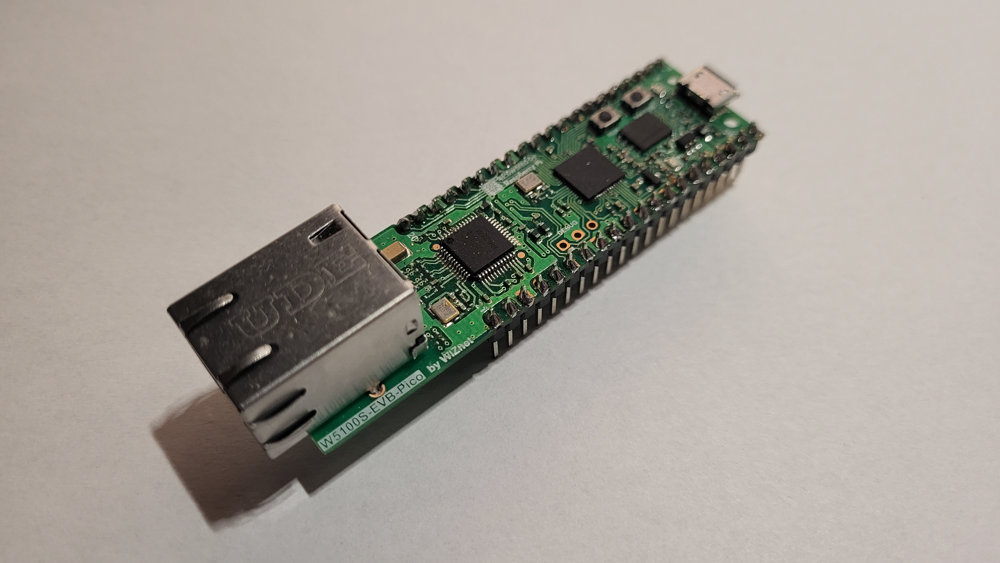

# stepper-ninja

An open-source, free, high performance step/generator and quadrature encoder interface for LinuxCNC using W5100S-evb-pico or pico + W5500 module.

## Features

- **communication**:

  - W5100S-evb-pico UDP Ethernet. <https://docs.wiznet.io/Product/iEthernet/W5100S/w5100s-evb-pico>
  - pico + W5500 module (need same wiring as W5100S-evb-pico)
  - planned support communication over spi with raspberry-pi4

- **step-generator**: multiple channels 512KHz per channel (30m/min with 0.001mm 1ms servo-thread). pulse width set from hal pin (430 - 6300 nS).

- **quadrature-encoder**: multiple channels 12.5MHz count rate per channel (theoretical).

- **Software**:
  - 1-8 PIO step generators and or quadrature encoders (current config 4 stepgen + 4 encoder)
  - LinuxCNC HAL driver supporting multiple instances (max 4), with safety functions (timeout, data checks). (tested with raspberry-pi4)

- **Open-Source**: code and docs under MIT License, quadrature-encoder PIO program uses BSD-3 license.

- **ready-to-ride**: w5100s-evb-pico and w5500 + pico version prebuilt uf2 in the binary directory. To install the hal driver you need to run the install.sh in the hal-driver directory

## Contributors

- **code**: atrex66

- **testing**: Jimfong1

## Contact

- **Discord**:

  - (stepper-ninja Discord)<https://discord.gg/bM2mQNCt>

## License

This project is licensed under the MIT License. See [LICENSE](LICENSE).
This project is also uses code under BSD-3 license. See [LICENSE.TXT](LICENSE.TXT) /firmware/w5100s-evb-pico/src/quadrature_encoder.pio
The `ioLibrary_Driver` in `firmware/pico/ioLibrary_Driver.zip` is licensed under the MIT License by Wiznet. See [firmware/pico/ioLibrary_Driver.zip/LICENSE.txt](firmware/pico/ioLibrary_Driver.zip/LICENSE.txt).
